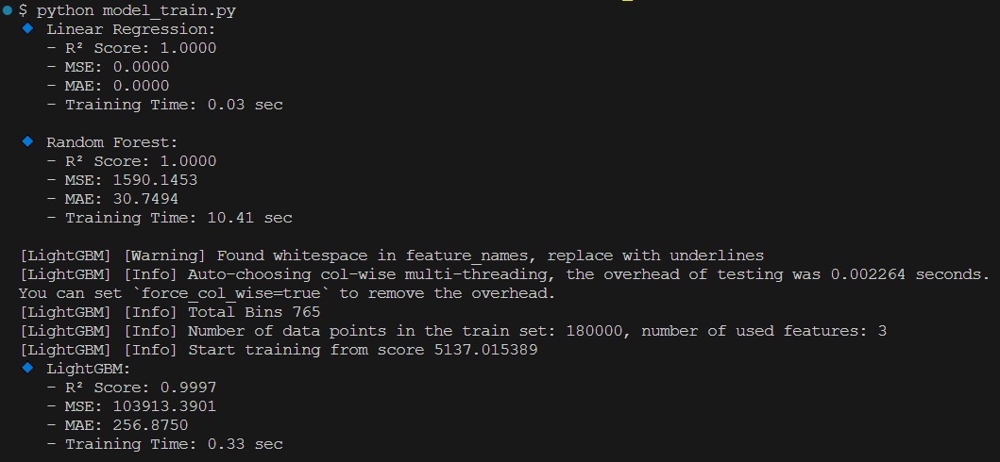
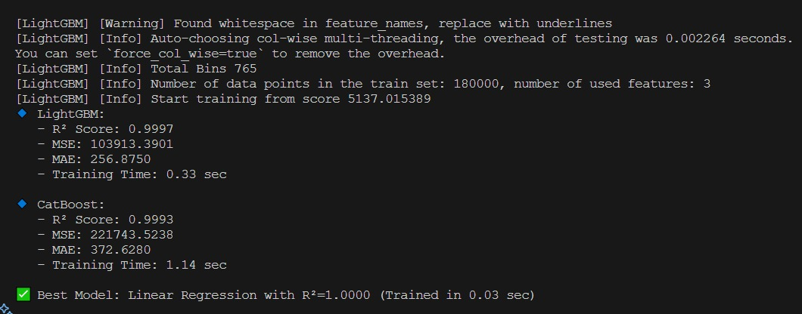
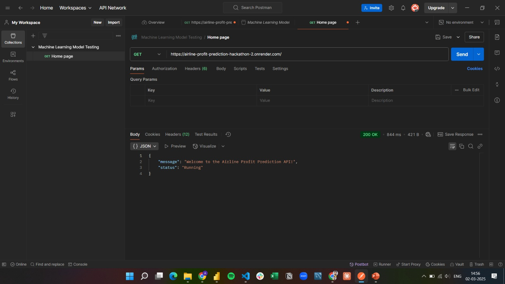
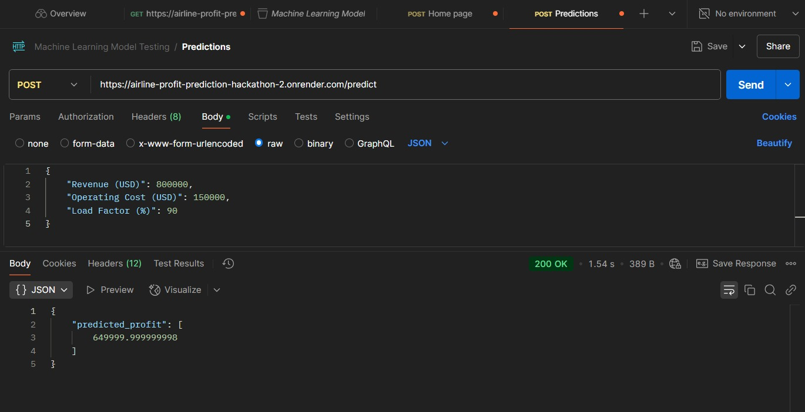

# Group Presentation Video Link-
https://drive.google.com/file/d/1YYSgRVVGoViOtf-8iqfeGioJI0Ac2YrG/view?usp=sharing

# ✈ Aviation Analytics & Profit Prediction

## 📌 Project Overview

This project aims to analyze aviation data, identify key performance indicators (KPIs), and build a machine learning model to predict flight profitability. The workflow includes data exploration, machine learning model development, and Power BI dashboard creation for insights.

---

## 📊 Dataset Details

The dataset contains flight-related KPIs such as revenue, expenses, load factor, and route details.

- **Data Source:** [Google Sheet](https://docs.google.com/spreadsheets/d/1eALZhnY5bEJ4uCi9BCjN2fpx8jRIzwWo/edit?usp=sharing&ouid=109976760607215104976&rtpof=true&sd=true)
- **Key Columns:**
  - Flight_ID
  - Revenue
  - Expenses
  - Profit (USD)
  - Load Factor (%)
  - Route
  - Flight Type (Domestic/International)
  - Other relevant features

---

## 🏗️ Project Workflow

### 1️⃣ Exploratory Data Analysis (EDA) & Preprocessing
- Data cleaning (handling missing values, duplicates, data type correction)
- Outlier detection and removal
- Correlation analysis & feature selection
- Data visualizations using Matplotlib & Seaborn

### 2️⃣ Machine Learning Model (Profit Prediction)
- Feature engineering
- Model selection (Regression algorithms: Linear Regression, Random Forest, XGBoost, etc.)
- Model training & evaluation
- Hyperparameter tuning

### 3️⃣ Power BI Dashboard
- Importing data from the processed dataset
- Creating KPIs & DAX measures
- Building interactive charts (profit trends, revenue vs expenses, top routes)
- Adding slicers for filtering by route, date, and flight type

---

## 🔧 Technologies Used

- **Programming:** Python (`pandas`, `numpy`, `seaborn`, `matplotlib`, `scikit-learn`)
- **Machine Learning:** Scikit-learn, XGBoost
- **Visualization:** Power BI
- **Version Control:** Git & GitHub

---

## 🚀 Setup Instructions

### 1️⃣ Clone the Repository
```sh
git clone https://github.com/Kapoor-Vishal/THE_DATA_ALCHEMISTS.git
cd THE_DATA_ALCHEMISTS
```

### 2️⃣ Install Dependencies
```sh
pip install pandas numpy matplotlib seaborn scikit-learn xgboost
```

### 3️⃣ Run EDA & Model Training
```sh
python eda_preprocessing.py
python train_model.py
```

### 4️⃣ Power BI Dashboard
1. Open **Power BI Desktop**
2. Load the processed dataset
3. Build visuals & create interactive dashboards

---

## 📌 Model Output & Deployment

### 📊 Machine Learning Model Output
<p align="center">
  
  
</p>

### 🚀 Model Deployment (Postman API Testing)
<p align="center">
  
  
</p>


---

##Power BI File Link 
https://drive.google.com/file/d/1DrL2gS_ZnCWfxfgNqqZMe9ljrvDpqsXq/view?usp=sharing
## 📬 Contact

For any queries, feel free to reach out:
- **Email:** [vishalkapoor9803@gmail.com](mailto:vishalkapoor9803@gmail.com)
- **GitHub Issues:** Create an issue in this repository.

📢 If you find this project useful, **give it a star ⭐** and contribute! 🚀
